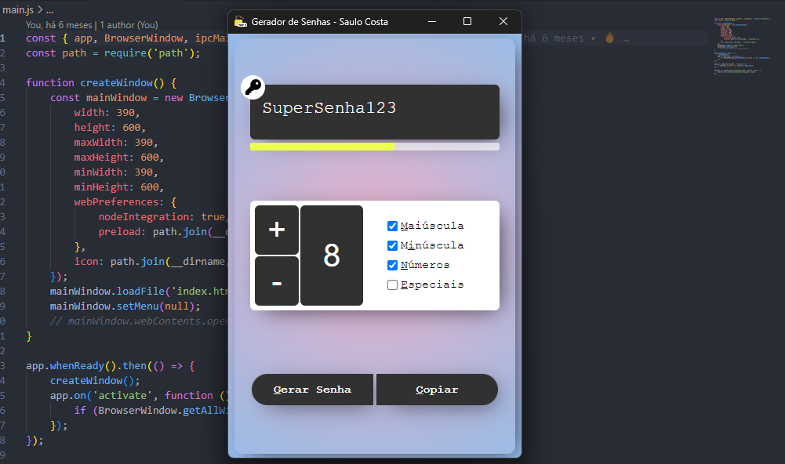

# GERADOR DE SENHAS

> Aplicativo para gerar senhas aleatórias



## COMO USAR?

```bash
git clone https://github.com/saulotarsobc/SC-Pass-Generator.git
cd SC-Pass-Generator;
yarn install;
yarn start;
# para gerar um exe na pasta 'dist'
yarn win;
```
