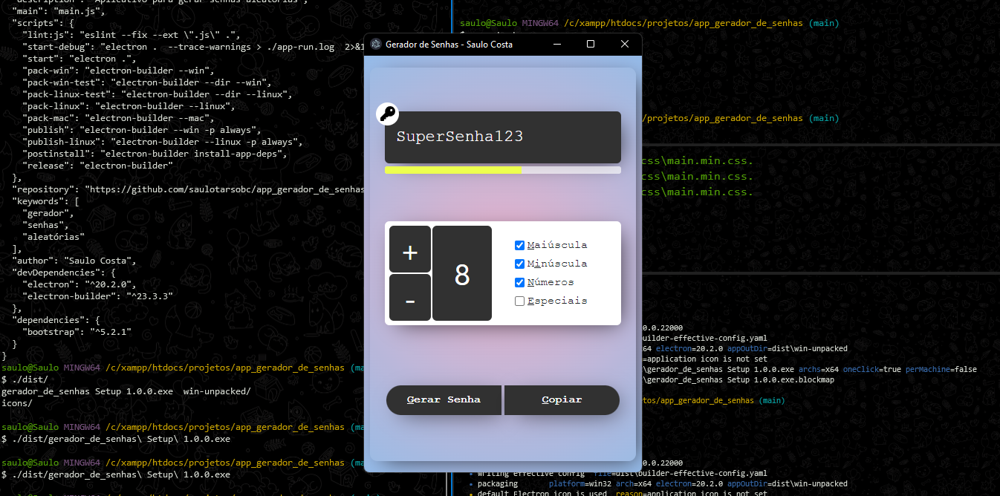

# GERADOR DE SENHAS

<div style="align-items:center">
    
</div>

<hr>
## REFÊRENCIAS

<ul>
    <li><a href="https://developer.mozilla.org/en-US/docs/Web/Accessibility/ARIA/Attributes/aria-hidden">MDN - aria-hidden</a></li>
    <li><a href="https://www.delftstack.com/pt/howto/javascript/shuffle-array-javascript/">Randomize ou Baralhe um Array em JavaScript</a></li>
    <li><a href="https://youtu.be/zx2axQoY_YM">Efeito de Máquina de Escrever com JavaScript - Origamid</a></li>
    <li><a href="https://youtu.be/yJoHOMN7vgM">Hcode - Construindo um Piano com HTML5</a></li>
    <li><a href="https://youtu.be/vqrjFnq3-uo">Mayk Brito - Criando Player de Áudio com Javascript</a></li>
</ul>

<hr>
## USE

```SH
npm install;
npm start;
## gerar app para windows ('electron-builder --win')
npm run pack-win;
```
